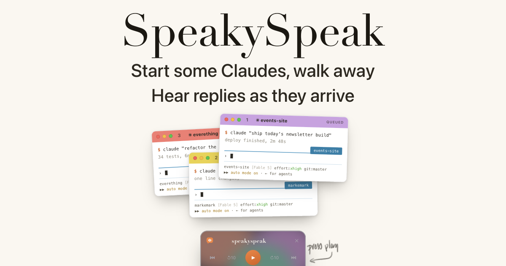

# SpeakySpeak

[](https://speakyspeak.com)

**This picture is [a live demo on speakyspeak.com](https://speakyspeak.com)** — press play there and hear three real replies read aloud.

**A macOS menu-bar deck that reads Claude Code's replies aloud.** When Claude finishes a turn, a Stop hook renders the reply with a local neural voice and queues it. Replies play **one at a time**, so several parallel Claude sessions never talk over each other.

Everything runs on your machine. No cloud TTS, no API keys, no subscription. Free and MIT-licensed.

It is a playback layer, not a voice mode: it never touches your input, so you keep typing normally and just hear the answers.

## Guide

[GUIDE.md](GUIDE.md) is the how-to-work-with-it doc: the `CLAUDE.md` timestamp rule that makes a queued backlog legible by ear, the suggested multi-session setup, and every setting explained in one place. Read it after installing.

## Feedback

Found a bug or want something changed? Email **[hi@speakyspeak.com](mailto:hi@speakyspeak.com)** and a human reads it and replies. Prefer public tracking? Open a [GitHub Issue](https://github.com/radam5000/speakyspeak/issues). Fastest of all: open **Settings ▸ About & support** (right-click the menu-bar icon → Settings…) and use **Email a report…**, which pre-fills an email with your version, engine, and recent log lines so the report arrives debuggable. **Have Claude write the report** does the same job the other way: it copies a prompt you paste into Claude Code, which reads the logs, writes the report, and opens the draft for you to send.

## Claude installs it — that's the point

There is no installer download. You paste one prompt into Claude Code and **your own Claude builds the app from source on your machine**, checking every step against its expected result as it goes ([INSTALL.md](INSTALL.md) is written for it to execute). This is deliberate, not a shortcut:

- Every user of this app already has Claude Code — the installer is sitting right there.
- The riskiest step is merging the hook into your existing `~/.claude/settings.json` without clobbering it. Claude reads your config and merges carefully; a blind script can't.
- It's more fun. You watch the thing get compiled for you, and afterwards the same Claude can customize it — a different voice, when it speaks, what it skips — because it just read the whole codebase.

```
Install SpeakySpeak on this Mac: clone https://github.com/radam5000/speakyspeak
and follow INSTALL.md step by step, verifying each step.
```

Prefer to drive? INSTALL.md doubles as a deterministic human walkthrough — every step is one command plus its expected output.

## What you need

- **macOS 14 or newer** and **Xcode Command Line Tools** (`xcode-select --install`). The app compiles from source in a few seconds and is ad-hoc signed, so there is no Gatekeeper or notarization dance. Note that *building* wants a current SDK, because the mini player uses macOS 26 Liquid Glass APIs behind availability checks; the app it produces runs on 14+.
- **Claude Code**, installed and signed in — in a terminal, the desktop app, VS Code, or Cursor. Hooks and settings live in `~/.claude/` regardless of which one you use, so the install is the same. (It's the Claude *Code* Stop hook this hangs off; it does not read the Claude chat app aloud.)
- **Apple Silicon** for the neural voice (Kokoro via MLX). On Intel it falls back to the built-in macOS `say` voice and everything else works.
- `jq` — required by the hook. Recent macOS ships it in `/usr/bin`; if `which jq` comes back empty, `brew install jq`. `ffmpeg`, `espeak-ng` and `uv` are only needed for the neural voice (`ffmpeg` does its loudness normalization; the `say` fallback doesn't use it).

## Install

```sh
git clone https://github.com/radam5000/speakyspeak.git
cd speakyspeak && ./install.sh
```

Then add two hook entries to `~/.claude/settings.json` (`install.sh` prints the exact snippet) and start a new Claude Code session. **[INSTALL.md](INSTALL.md) is the full step-by-step**, including the neural-voice setup and troubleshooting — it's written to be handed to Claude Code, which will run it and adapt it to your setup. ([SETUP.md](SETUP.md) is the older human-readable walkthrough.)

The rest of this README is the architecture and controls reference.

---

App source and hook sources both live in this repo. Run `./install.sh` to build and install everything. The moving parts at runtime:

- `~/Applications/SpeakySpeak.app` — the built app (single-file swiftc, ad-hoc signed, LSUIElement). `./build.sh` rebuilds just the app (and copies `Icon/AppIcon.icns` + `Icon/SyGlyph.png` in). The brand mark is the hand-made `Icon/SyLogo.png` (white Optima "Sy" on a black tile); `Icon/render-icon.swift` lifts the white "Sy" into a tintable transparent shape (`SyGlyph.png`, used for the menu bar) and composes it onto a squircle for the 1024 master, and `Icon/make-icon.sh` slices that into `AppIcon.icns`. Re-run `Icon/make-icon.sh` after editing `SyLogo.png`.
- `~/.claude/hooks/speak-reply.sh` (Stop hook) — wakes the app, renders each reply with Kokoro (falls back to `say`), and drops `<epoch>-<sid>.m4a` + `.json` into the queue. `~/.claude/hooks/session-end.sh` (SessionEnd hook) drops `.end` so the deck clears that session's *played* items (unheard replies stay). Live copies in `~/.claude/hooks/`, sources in `hooks/` here — edit here, `./install.sh` copies. Wired in `~/.claude/settings.json` (snippet printed by install.sh).
- `/tmp/claude-speech/queue/` — runtime queue. `.done` markers persist played state across app restarts. Logs: `/tmp/claude-speech/deck.log` (app), `hook.log` (hook).

## Controls

- **Menu-bar icon** — left-click drops the deck down as a popover (dismisses when you click away); right-click (or ctrl-click) opens a Settings… / Mute / Quit menu. The icon is the **"Sy" brand mark** (the exact Optima letterforms from the app icon, drawn as a template so it tints for light/dark bars) and there is no alternate icon set. It carries a queue-count badge **before** the mark, so the mark itself never moves as the count changes; it **pulses** with speech loudness while playing; and it wears a **diagonal slash** whenever nothing will be heard, meaning speech off, muted, or paused mid-reply. The exact state is in the hover tooltip. A new reply never forces a window forward — the badge and pulse signal it instead.
- **Speaker (top right area)** — the single on/off. Muted: replies keep rendering and queueing ("chats build up"), nothing is read aloud. Persists across restarts (so do playback rate and volume).
- **Volume slider** (between speaker and speed) — playback volume, 0–100%. Renders are loudness-normalized to −16 LUFS in the hook (Kokoro's raw output is ~12dB quieter than `say`), so 100% ≈ normal speech level.
- **Skip = stop this reply.** The skip button (now-playing transport and the mini HUD) stops whatever's speaking and plays the next queued reply, or goes quiet if nothing's queued — unlike Mute/Pause, it doesn't shut the whole pipeline down, it just drops the one track you don't want to hear. Works even with an empty queue.
- **Mini HUD** — whenever a reply starts speaking, a tiny floating panel drops under the menu-bar icon with the title and a full transport: **back-track / back-10 / play-pause / forward-10 / skip** (the two track buttons pinned to the far edges), so one click controls what you're hearing without opening the full deck. "Back-track" (far left) restarts the current reply, then steps to the previously-played one if you're already near the start (music-player style); "skip" (far right) stops the current one and moves on. A **glowing progress bar along the bottom** shows how far into the reply you are. It bridges the gap between queued replies and fades out a moment after things go quiet. **Drag it anywhere** — grab the background and move it; the spot sticks across launches instead of snapping back under the icon. When a reply starts — or you skip forward / step back / restart — it **flashes bright glowing white** for a moment so it's easy to spot wherever you've parked it. Its surface is **Liquid Glass** on macOS 26+ (Settings ▸ Appearance can switch it to the classic frosted card if the glass contrast is hard to read over some backgrounds). An **X dismisses it for the current reply only** — it pops back up on its own when the next reply starts. Non-activating, so it never steals focus or interrupts typing. Left-clicking the icon still opens the full deck.
- **Global hotkey — ⌃⌥⌘Space** ("quiet now") — system-wide; stops the current reply (skips to the next if queued, else silent). Registered via Carbon, so no Accessibility/Input-Monitoring permission prompt. No-op when nothing's playing (never cold-starts audio).
- **Rows** — the row itself is inert; the left icon is pure status (bright orange dot = plays next, dim orange dot = queued, spark = speaking now, gray check = played). Actions are on the right: hover for play-now / remove. Queued rows sit under a **session header** (title, reply count, time span) with its own hover actions: **Play this session next** and **Remove this session's queued replies**.
- **Toolbar row** — sits on the "Up next" line, above the list: ⇅ sort menu (grouping and play order, see [Ordering rules](#ordering-rules)), sweep icon clears all played replies, trash icon deletes everything (played and queued), gear opens Settings. **Hovering any of them replaces the "Up next" label with what that control does**, so there's no separate hint line. An available update still appears at the bottom left.
- **Settings** — gear in the footer, or right-click the icon → Settings…. A native grouped window for the knobs that used to require editing dotfiles by hand (engine + voice), plus playback/appearance, plus **About & support** (version, updates, and the two ways to send a report). See below.
- **Updates** — when a new version is out, the menu-bar icon grows a ↑ next to it and the deck's footer shows "Update X available"; both point at **Settings ▸ About & support**, where the "Update to X…" button pulls, rebuilds, and relaunches. The same section has a "Check for updates" button when you're already current (it also checks once a day on its own).
- **Quit** — right-click the menu-bar icon → Quit (also right-click anywhere on the panel itself).
- `~/.claude/speak-off` remains a shell-side hard kill (hook won't render at all); the deck watches it and shows "Speech is off" when present.
- **AirPods / media keys** — the deck publishes to macOS Now Playing while a reply is speaking (or paused mid-reply, or more are queued): one AirPods stem click pauses/resumes, double-click skips to the next reply, triple-click restarts/steps back; Control Center gets a working scrubber. The claim is released when the deck goes idle, so headphone clicks return to Music/Spotify.
- **Shared-AirPods lead-in** — the headphones only switch to this Mac once it starts producing audio, and that takes about a second, which used to eat the opening words of the first reply after the other Mac spoke. When the deck has been silent longer than 6s, playback is *scheduled* `speak-lead-in` seconds ahead (default 1.2) instead of started immediately: the output device engages now and runs through the gap, and the speech starts once the route has arrived. Chained replies never pay it (their gap is ~2s). `~/.claude/speak-lead-in` tunes it; `0` disables.
- **Two Macs, one pair of AirPods** — put the *other* Mac's Tailscale IP in `~/.claude/speak-peer` on each machine and the decks take turns: before *auto*-playing, a deck asks the peer (TCP 48765, "playing"/"idle") and holds until it's quiet, so macOS's AirPods auto-switching hands off at the gap instead of tug-of-warring mid-sentence. Manual plays never wait. Checks fail open — no file, peer off, or unreachable all mean "just play."

## Settings

The settings window is the GUI front for the same `~/.claude` dotfiles the Stop hook reads — it writes them, so there's one source of truth and shell edits still work.

- **Speak Claude's replies** — master switch; off creates `~/.claude/speak-off` (stops *rendering* entirely). Distinct from Mute, which keeps rendering/queueing but doesn't play aloud.
- **Read replies** — *when* speech happens. **When Claude finishes** (the default) reads a reply only once Claude stops and is waiting for you — the original behaviour. The other two read a long agentic run **as it happens**, which matters when Claude asks you to do something ("press the button now") twenty minutes into a run that hasn't ended yet: **As it works, skipping short lines** reads each step but stays quiet for short connecting lines like "Let me check that." (threshold: `~/.claude/speak-min-words`, default 15), and **As it works, every line** reads all of them. → `~/.claude/speak-when` (`end` | `substantial` | `all`; absent = `end`). The mid-run modes need the `PostToolUse` hook registered — see [INSTALL.md](INSTALL.md) step 5. It is the same script, and in the default mode it exits in ~30ms without doing anything.
- **Voice** — Kokoro voices (curated English set; → `speak-voice-kokoro`) when Kokoro is installed, else the installed `say` voices (enumerated from `say -v '?'`; → `speak-voice`, "Automatic" = best probed) with a words-per-minute **Rate** (→ `speak-rate`). No Engine row in the UI — `~/.claude/speak-engine` still overrides from the shell. The ▶ beside the picker previews the selected voice ("Hi, I'm …"); switching voices mid-preview hops to the new one. Kokoro samples render via the warm daemon (cold CLI fallback — which also fetches a voice missing from the offline HF cache) and cache in `/tmp/claude-speech/preview/`.
- **Voice change re-speaks the queue** — closing Settings with a different Kokoro voice re-renders all *queued* (unplayed) items in it, warm-daemon-only (daemon down = old audio kept), atomic swap per file. Needs the manifest's `text` field, so items queued before 2026-07-20 keep their voice.
- **Playback** — speed, volume, mute (app prefs, same as the deck controls).
- **Appearance** — the **reading panel** style (**Liquid Glass** — translucent Apple glass with adaptive glass transport keys, macOS 26+ — or **Frosted (classic)**, the solid, always-legible material card; Liquid Glass is the default on macOS 26 and greys out below it); and **when it shows** — **Only while speaking** (auto-appears with a reply, fades after — the default) or **Always visible** (a persistent little controller that stays on screen; the X dismiss is hidden in this mode). All app prefs.

## Ordering rules

By default the queue is a flat list, newest first. Two settings in the sort menu (the ⇅ button on the "Up next" line) change that, and they persist:

| Setting | Choices | What it does |
| --- | --- | --- |
| **Group by** | None · Session | Whether replies are grouped into one run per Claude Code session. |
| **Order by** | Newest first · Oldest first | The direction for everything: the replies inside a group, and the groups themselves. |

Sorting the list **is** sorting the queue: the deck reads it from the top down.

**Why grouping helps.** Several Claude Code sessions talk at once, and each one's replies are a sequence: agent 1 lands, then agent 2, and reply 8 only makes sense after reply 1. Set Group by to Session and Order by to Oldest first and you hear each session's story in the order it happened, one session at a time, instead of a backwards interleaving of all of them.

- **A new arrival extends its own group's run** rather than jumping the queue, so an unrelated session is never spliced into the middle of a story.
- **Overrides:** "Play now" on a row plays that one reply immediately; "Play this session next" on a group header moves that whole run to the front once the current reply finishes.
- The now-playing card and the mini HUD show **"2 of 6"** — where this reply sits in its group's run, so you know how much of the story is left. It's hidden when nothing is grouped.
- A reply paused mid-way is never preempted by autoplay; new arrivals wait.
- On launch, a restored backlog stays silent — only when a reply arrived in the last 2 minutes does playback start, and it then starts at the head of the play order (that live session's oldest unheard reply), because the earlier replies are the context that makes the fresh one make sense.

## Voice engine

Default engine is **Kokoro-82M**, a local neural TTS running on MLX — free, on-device, ~8× realtime on the M3 Pro.

**Warm daemon (the speed path).** Spawning the Kokoro CLI cold on every reply paid a ~3s model-load tax each time. `hooks/tts-daemon.py` (a LaunchAgent, `com.adamraabe.speakyspeak-tts`) loads Kokoro **once** at login, warms the MLX graph, and then renders each reply in ~0.3–0.9s. The Stop hook talks to it through a filesystem request queue (`/tmp/claude-speech/render/*.req` → `<out>.wav` + `*.done`, with a `daemon.alive` heartbeat), and **only** when the heartbeat is fresh — on a stale/absent heartbeat, timeout, or error it falls straight through to the cold CLI (then `say`), so the daemon is a pure speedup with no new failure mode. `install.sh` writes + bootstraps the LaunchAgent (skipped if mlx-audio isn't installed). Logs: `/tmp/claude-speech/tts-daemon.log`. Runs offline (`HF_HUB_OFFLINE=1`).
 Installed as a uv tool (pinned: `uv tool install --python 3.12 "mlx-audio[tts]==0.4.1" --with "misaki[en]" --with "en_core_web_sm @ <spacy-models release wheel URL>"`; 0.4.4 has a length-dependent broadcast_shapes regression, [issue #784](https://github.com/Blaizzy/mlx-audio/issues/784) — re-test newer versions before unpinning). Requires `brew install espeak-ng`. If the binary is missing or a render fails, the hook falls back to `say` automatically.

Knobs: `~/.claude/speak-engine` (`kokoro` | `say`; absent = kokoro when installed), `~/.claude/speak-voice-kokoro` (default `bf_lily`; ~54 voices in the model card — new voices need one online render to cache, since the warm daemon runs offline; `install.sh` pre-caches the active one). `say`-only knobs: `~/.claude/speak-rate` (wpm), `~/.claude/speak-voice` (absent = best installed voice is probed — Premium/Enhanced preferred, system default as last resort, so a fresh Mac never fails silent). The deck only cares about the .m4a/.json contract, so any engine that produces those works. The in-app Settings window writes these same files (and re-reads them on open), so the GUI and shell edits stay in sync.

## What gets spoken

**The whole turn's prose, not just its last paragraph.** A reply is usually split across several assistant text entries with tool calls between them — an answer, an artifact publish, a closing note. The hook once spoke only the final entry, so everything before the last tool call went unread. Two separate jobs do this now, and it matters that they stay separate:

- `extract()` is the **gate** — it decides *when* to speak, and only fires once the transcript's last assistant entry is a settled text entry. This is what keeps mid-turn preambles and the Stop-event flush race from being mistaken for the reply. Don't repurpose it.
- `gather_turn()` decides *what* — every assistant text entry back to the nearer of two boundaries: the last real user message, or the entry that was already spoken (its uuid is recorded in `/tmp/claude-speech/.seen-<sid>`, so a turn that resumes without a new user prompt doesn't re-read everything). Tool results, meta injections, and the `system`/`frame-link`/`mode` bookkeeping entries are not turn boundaries; subagent (sidechain) and thinking blocks are excluded.

The gathered text is used only when it still **ends with** the entry the gate settled on; otherwise the hook falls back to that entry alone, so the widening can never speak something the gate didn't approve. Side effect worth knowing: in a long agentic turn you now also hear the short progress lines ("Now the wiki-link fix itself."), because those are on screen too.

## Listenable text

Before rendering, `speak-reply.sh` rewrites the reply into something tuned for the ear, not the eye (the `clean=` block — one Unicode-aware `perl` pass between dropping code fences and stripping markdown symbols):

- emoji / icons / symbol glyphs → removed; arrows (→) → "to"
- slash-commands (`/code-review`) → spoken words ("code review")
- markdown links `[text](url)` → just the text; bare URLs → "link"
- long/absolute paths (`~/Development/speakyspeak/main.swift`) → basename ("main.swift")
- leftover markdown (`*_\`#>|`), list bullets, and double-spaces → cleaned up

It's a *light* pass — inline identifiers and prose are left intact; it only strips what reads as gibberish aloud. The same cleaned text feeds the deck's row preview. Gotcha for future edits: running a nested `s///` inside the perl replacement clobbers `$1` (the captured leading space) — the slash-command rule uses `tr///r` for exactly this reason.

## Status (2026-06-22)

Added "quiet without killing the pipeline": skip-as-stop on the transport, an auto-showing mini HUD under the menu-bar icon while speaking (with an X to dismiss it for the current reply), and a system-wide ⌃⌥⌘Space hotkey to silence the current reply (Carbon hotkey, no permission prompt). Also a listenable-text pass in the hook (strips emoji/markdown, speaks slash-commands and paths as words). Earlier (2026-06-15): moved from an always-on-top floating panel to a menu-bar deck (popover on click), added the "Sy" brand mark (menu-bar glyph + app icon), and a settings window fronting the engine/voice dotfiles. Earlier: sequencing + enable/disable hardening (pause-steal, stale-player race, session-end deletions, mute persistence, stop-time ordering, power toggle). Dev history before this repo lives in `git -C ~/.claude log -- tools/speakyspeak tools/claude-speak tools/speech-deck`.

## License

MIT. See [LICENSE](LICENSE).
